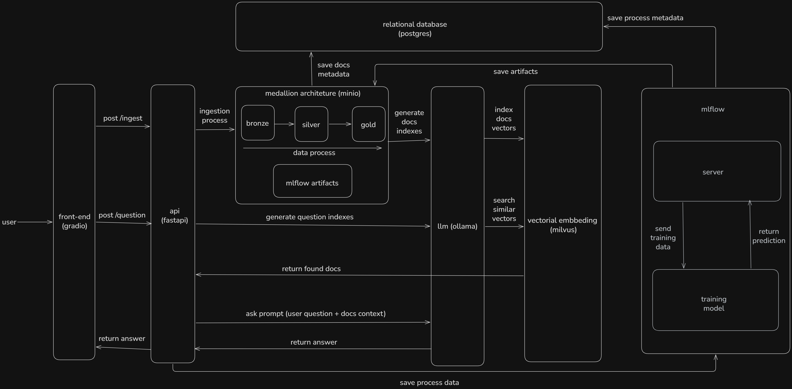

# Urban Lens

## Integrantes

| Nome | E-mail | RA |
|---|---|---:|
| Diego Justino da Silva | diegojsilva01@outlook.com | 223705 |
| Diogo Francia | diogofrancia2@gmail.com | 222558 |
| Felipe Augusto de Almeida Mariano | felipemariano99@gmail.com | 210045 |
| João Rafael Jordão Pereira | jrafael1504@gmail.com | 211903 |
| Kaique Medeiros Govani | kaique.govani@hotmail.com | 210170 |
| Lucas Da Silva Marques | lucasses10@gmail.com | 223402 |
| Lucas de Moraes Silveira | lucasdmsilveira@gmail.com | 211668 |
| Lucas Ferreira Neto | ferreiranetolucas@gmail.com | 223026 |
| Mateus Nauhan Vieira Matos | mateusnauhan@gmail.com | 211931 |
| Milton Rogerio Dotto Penha Junior | miltonjmiltonj@gmail.com | 222284 |
| Nicolas Leonardi Barsalini | nicolasbarsalini2017@gmail.com | 222259 |
| Raphael Nobuyuki Haga Okuyama | raphaelokuyuama123@gmail.com | 222808 |

---

## 1. Sobre o projeto

O **Urban Lens** é uma plataforma **RAG (Retrieval-Augmented Generation)** local, desenvolvida para apoiar a **inteligência da prefeitura** na análise de dados públicos de segurança urbana. A solução tem como objetivo organizar, tratar, indexar e disponibilizar consultas em linguagem natural sobre dados públicos, permitindo que gestores e analistas obtenham respostas rápidas e contextualizadas para apoiar decisões de prevenção, planejamento territorial e formulação de políticas públicas.

A proposta do projeto utiliza como base dados públicos do [DATA.POLICE.UK](https://data.police.uk/data/), com foco em análise histórica e apoio estratégico, e não em operação policial em tempo real.

---

## 2. Problema de negócio

Prefeituras e núcleos de inteligência urbana frequentemente possuem dificuldade em transformar grandes volumes de dados públicos em informações úteis, auditáveis e acessíveis para tomada de decisão.

Mesmo quando os dados estão disponíveis, eles geralmente se encontram:
- dispersos;
- pouco padronizados;
- difíceis de consultar;
- sem mecanismos de busca semântica;
- sem uma interface simples para uso por gestores e analistas.

Dessa forma, o projeto propõe uma plataforma capaz de consolidar esses dados em uma arquitetura governada, com recuperação inteligente de contexto e geração de respostas por meio de um modelo de linguagem local.

---

## 3. Objetivo

Desenvolver uma plataforma completa de **RAG local com governança de dados**, capaz de:

- ingerir dados públicos de segurança urbana;
- armazená-los em arquitetura **Medallion**;
- organizar metadados e versionamento;
- gerar embeddings e indexação vetorial;
- responder perguntas em linguagem natural;
- disponibilizar uma interface simples para consulta;
- manter toda a solução executável localmente com containers.

---

## 4. Domínio escolhido

O domínio escolhido para o projeto é **Inteligência Territorial para Prefeituras**, com foco em análise de segurança urbana baseada em dados públicos.

### Aplicações esperadas

A solução poderá apoiar a prefeitura em tarefas como:
- priorização territorial;
- análise histórica de ocorrências;
- identificação de padrões por bairro ou período;
- apoio à definição de ações preventivas;
- geração de relatórios para gestores públicos.

---

## 5. Empresa fictícia

**Urban Lens Analytics**

A empresa fictícia **Urban Lens Analytics** atua no desenvolvimento de soluções de inteligência urbana orientadas por dados, oferecendo ferramentas para análise territorial, observação de tendências e apoio estratégico à administração pública.

### Produto

**Urban Lens**

Produto voltado para consulta inteligente de dados e documentos, utilizando RAG e interface simples para auxiliar o núcleo de inteligência da prefeitura.

---

## 6. Arquitetura da solução

### Diagrama da arquitetura

Abaixo está o diagrama macro da arquitetura proposta para o **Urban Lens**, mostrando o fluxo entre ingestão, processamento em arquitetura Medallion, indexação vetorial, camada de aplicação e componentes de MLOps.



A arquitetura do projeto segue o modelo proposto em sala, contemplando as seguintes camadas:

### Camada de Dados

- **MinIO**: Data Lake com arquitetura Medallion
  - **Bronze**: dados brutos
  - **Silver**: dados tratados e padronizados
  - **Gold**: dados consolidados para consumo analítico

- **PostgreSQL**
  - metadados;
  - auditoria;
  - controle de versionamento.

- **Milvus**
  - armazenamento vetorial;
  - embeddings;
  - recuperação semântica.

- **Attu**
  - interface visual para inspeção do Milvus;
  - apoio à validação de coleções e indexação vetorial em ambiente local.

### Camada de IA

- **Ollama**
  - inferência local com LLM;
  - modelo de embeddings.

- **Pipeline RAG**
  - chunking;
  - embedding;
  - indexação;
  - recuperação;
  - geração de resposta.

### Camada de MLOps

- **MLflow**
  - tracking de experimentos;
  - métricas;
  - versionamento de prompts;
  - acompanhamento de testes.

### Camada de Aplicação

- **FastAPI**
  - endpoints da aplicação;
  - integração com o pipeline RAG;
  - documentação Swagger como entregável acadêmico.

- **Frontend simples (Next.js)**
  - interface de consulta para o usuário final;
  - integração com a API real do projeto.

### Infraestrutura

- **Docker**
- **Docker Compose**
- **Makefile**

---

## 7. Tecnologias utilizadas

- Python
- FastAPI
- Next.js
- PostgreSQL
- MinIO
- Milvus
- Attu
- Ollama
- MLflow
- Docker
- Docker Compose
- Makefile

---

## 8. Fonte de dados

O projeto utiliza dados públicos do **DATA.POLICE.UK**, que disponibiliza informações históricas relacionadas à segurança pública, como:
- crimes em nível de rua;
- outcomes;
- stop and search;
- prioridades de neighbourhood;
- informações por força policial e região.

Esses dados são usados para apoiar análises históricas e territoriais no contexto da inteligência municipal.

---

## 9. Público-alvo

A solução é voltada principalmente para:
- analistas de inteligência da prefeitura;
- gestores públicos;
- secretarias municipais;
- observatórios urbanos;
- equipes de planejamento territorial.

---

## 10. Estado atual da entrega

Até a **Sprint 8 / AC2**, o projeto já entrega:

- pipeline Bronze -> Silver -> Gold com governança;
- catálogo, versionamento e auditoria em PostgreSQL;
- geração de embeddings e indexação vetorial no Milvus;
- validação visual do índice via Attu;
- RAG funcional com busca vetorial, construção de prompt e inferência local;
- API FastAPI com endpoints documentados;
- frontend simples integrado à API real;
- roteiro de demonstração com datasets leves para execução ao vivo.

---

## 11. Documentation Hub

| Documento | Descrição |
|----------|------------|
| [How to run](docs/how-to-run.md) | Setup, serviços locais e execução do ambiente |
| [Implementation Guide](docs/implementation-guide.md) | Execução ponta a ponta do pipeline governado |
| [AC2 Sprint Closure](docs/ac2-sprint-closure.md) | Mapeamento formal das Sprints 1 a 8 para evidências do repositório |
| [Delivery Plan](docs/governance-medallion-delivery-plan.md) | Plano interno de execução e status das tarefas |
| [Demo Professor](docs/demo-professor.txt) | Roteiro prático da demonstração ao vivo |
| [Product Vision](docs/product-vision.md) | Visão de produto |
| [Full Document (PDF)](docs/urban_lens_visao_consolidada.pdf) | Especificação consolidada do projeto |

---

## 12. Como executar o projeto

Esta seção consolida a operação local do Urban Lens a partir do `Makefile`, do `docker-compose.yml`, do `docker-compose.prod.yml`, do `.env.example` e dos guias em `docs/`.

### Pré-requisitos

- Git
- Docker com Docker Compose, `docker-compose` ou `podman-compose`
- GNU Make
- Python 3.11+
- Node.js com `npm` ou `pnpm`

### Setup inicial

1. Clone o repositório e entre na pasta do projeto:

```bash
git clone https://github.com/felipemariano29/urban-lens.git
cd urban-lens
```

2. Crie o arquivo de ambiente:

```bash
cp .env.example .env
```

3. Revise portas e credenciais em `.env`, se necessário. As principais variáveis são:

| Variável | Uso |
|---|---|
| `POSTGRES_*` | credenciais e porta local do PostgreSQL |
| `MINIO_*` e `URBAN_LENS_S3_*` | credenciais, bucket e endpoint do MinIO |
| `MLFLOW_TRACKING_URI` e `MLFLOW_HOST_PORT` | tracking e porta local do MLflow |
| `RAG_API_HOST_PORT` e `URBAN_LENS_API_BASE_URL` | porta e base URL da API FastAPI |
| `MILVUS_*` e `ATTU_HOST_PORT` | portas do Milvus e da UI Attu |
| `OLLAMA_HOST_PORT`, `URBAN_LENS_OLLAMA_BASE_URL` e `URBAN_LENS_EMBEDDING_MODEL` | servidor local Ollama e modelo de embeddings |

4. Execute o setup completo:

```bash
make setup
```

Esse comando cria a `.venv`, instala o pacote Python em modo desenvolvimento, sobe a infraestrutura, instala as dependências do frontend, exibe as URLs e inicia o frontend Next.js.

Se preferir executar por etapas:

```bash
make venv
make install
make up
make frontend-install
make urls
make frontend
```

### Fluxo recomendado de operação

1. Criar `.env` a partir do exemplo:

```bash
cp .env.example .env
```

2. Subir o ambiente completo:

```bash
make fullstack
```

Ou usar `make setup` quando também quiser criar a `.venv` e instalar dependências Python.

3. Verificar as URLs dos serviços:

```bash
make urls
```

4. Listar os snapshots disponíveis em `data/`:

```bash
make snapshots
```

5. Ingerir e processar um snapshot mensal até Gold:

```bash
make ingest SNAPSHOT_DIR=data/2023-02 ACTOR=analyst
```

6. Treinar os modelos com os datasets Gold ML mais recentes:

```bash
make train-latest ACTOR=analyst
```

7. Indexar embeddings do dataset Gold RAG mais recente:

```bash
make index-embeddings-latest ACTOR=analyst
```

8. Indexar a documentação Markdown em `docs/`:

```bash
make index-docs DOCS_DIR=docs ACTOR=analyst
```

9. Executar os testes automatizados:

```bash
make test
```

### URLs locais

As URLs são calculadas a partir do `.env` pelo comando `make urls`.

| Serviço | URL padrão |
|---|---|
| pgAdmin | `http://localhost:5050` |
| MinIO API | `http://localhost:9012` |
| MinIO Console | `http://localhost:9003` |
| MLflow | `http://localhost:5005` |
| Milvus gRPC | `localhost:19530` |
| Milvus REST | `http://localhost:9091` |
| Attu | `http://localhost:3001` |
| Ollama | `http://localhost:11434` |
| RAG API / Swagger | `http://localhost:8000/docs` |
| Frontend | `http://localhost:3000` |

### Compose de produção

O arquivo `docker-compose.prod.yml` define os serviços `mlflow` e `rag-api` para um ambiente externo configurado por `.env.prod`. Ele não é acionado pelos comandos atuais do `Makefile`; para usá-lo, execute Docker Compose diretamente com esse arquivo e garanta que PostgreSQL, MinIO e demais dependências externas estejam configurados no `.env.prod`.

---

## 13. Comandos Make disponíveis

Os comandos abaixo foram levantados diretamente do `Makefile`. O padrão de execução é:

```bash
make comando VAR=valor OUTRA_VAR=valor
```

Variáveis globais aceitas por vários comandos:

| Variável | Obrigatória? | Padrão | Uso |
|---|---:|---|---|
| `PYTHON` | não | detecta `.venv` ou Python do sistema | interpretador usado pelos jobs Python |
| `SYSTEM_PYTHON` | não | `python` no Windows, `python3` nos demais sistemas | interpretador usado para criar `.venv` |
| `PIP_CONFIG_FILE` | não | `/dev/null` | configuração de pip usada no install |
| `PIP_INDEX_URL` | não | `https://pypi.org/simple` | índice de pacotes Python |
| `SOURCE_NAME` | não | `data.police.uk` | fonte registrada nos metadados |
| `ACTOR` | não | `system` | ator registrado em auditoria e execuções |
| `VERSION` | não | vazio | versão Gold desejada em comandos `*-latest` |
| `BATCH_SIZE` | não | `32` | tamanho de lote para indexação vetorial |

### Setup inicial

| Comando | Finalidade | Exemplo | Variáveis obrigatórias | Variáveis opcionais |
|---|---|---|---|---|
| `make help` | Mostra a ajuda do projeto com os comandos principais. | `make help` | nenhuma | nenhuma |
| `make setup` | Cria `.venv`, instala dependências Python, sobe a stack, instala dependências do frontend, mostra URLs e inicia o frontend. | `make setup` | arquivo `.env` para a etapa de infraestrutura | `SYSTEM_PYTHON`, `PYTHON`, `PIP_CONFIG_FILE`, `PIP_INDEX_URL` |
| `make venv` | Cria o ambiente virtual local em `.venv`, se ele ainda não existir. | `make venv` | nenhuma | `SYSTEM_PYTHON` |
| `make install` | Instala o pacote Python em modo desenvolvimento com extras de dev. | `make install` | nenhuma | `PYTHON`, `PIP_CONFIG_FILE`, `PIP_INDEX_URL` |

### Docker / infraestrutura

| Comando | Finalidade | Exemplo | Variáveis obrigatórias | Variáveis opcionais |
|---|---|---|---|---|
| `make fullstack` | Sobe a stack Docker, instala dependências do frontend, mostra URLs e inicia o frontend em modo dev. | `make fullstack` | arquivo `.env` | portas e credenciais definidas no `.env` |
| `make up` | Sobe todos os serviços do `docker-compose.yml` em background. | `make up` | arquivo `.env` | portas e credenciais definidas no `.env` |
| `make up-core` | Sobe apenas PostgreSQL, MinIO, bootstrap do MinIO e MLflow. | `make up-core` | arquivo `.env` | portas e credenciais definidas no `.env` |
| `make down` | Para os containers sem remover dados locais. | `make down` | arquivo `.env` | nenhuma |
| `make destroy` | Remove containers e rede local, preservando os dados bindados em `docker-data/`. | `make destroy` | arquivo `.env` | nenhuma |
| `make reset` | Remove containers e volumes do Compose e sobe um ambiente limpo com build. | `make reset` | arquivo `.env` | nenhuma |
| `make logs` | Exibe logs em tempo real de todos os serviços do Compose. | `make logs` | arquivo `.env` | nenhuma |
| `make logs-mlflow` | Exibe logs em tempo real do serviço MLflow. | `make logs-mlflow` | arquivo `.env` | nenhuma |
| `make ps` | Mostra o status dos serviços do Compose. | `make ps` | arquivo `.env` | nenhuma |
| `make urls` | Mostra as URLs locais dos serviços. | `make urls` | arquivo `.env` | portas definidas no `.env` |
| `make mlflow-url` | Mostra apenas a URL local do MLflow. | `make mlflow-url` | arquivo `.env` | `MLFLOW_HOST_PORT` |

### Frontend

| Comando | Finalidade | Exemplo | Variáveis obrigatórias | Variáveis opcionais |
|---|---|---|---|---|
| `make frontend-install` | Instala dependências do frontend usando `pnpm` quando disponível, senão `npm`. | `make frontend-install` | `package.json` e `pnpm` ou `npm` instalado | nenhuma |
| `make frontend` | Inicia o frontend Next.js em modo desenvolvimento. | `make frontend` | `package.json` e `pnpm` ou `npm` instalado | variáveis de ambiente lidas pelo Next.js, como `URBAN_LENS_API_BASE_URL` |

### Pipeline de dados

| Comando | Finalidade | Exemplo | Variáveis obrigatórias | Variáveis opcionais |
|---|---|---|---|---|
| `make snapshots` | Lista os diretórios de snapshot disponíveis em `data/`. | `make snapshots` | diretório `data/` | nenhuma |
| `make ingest` | Alias de `process-snapshot`; processa um snapshot mensal até Gold. | `make ingest SNAPSHOT_DIR=data/2023-02 ACTOR=analyst` | `SNAPSHOT_DIR` | `SOURCE_NAME`, `ACTOR`, `PYTHON` |
| `make ingest-all` | Processa todos os snapshots encontrados em `data/`. | `make ingest-all ACTOR=analyst` | arquivo `.env`, diretório `data/` com snapshots | `SOURCE_NAME`, `ACTOR`, `PYTHON` |
| `make ingest-year` | Processa todos os snapshots de um ano específico em `data/`. | `make ingest-year YEAR=2023 ACTOR=analyst` | `YEAR` | `SOURCE_NAME`, `ACTOR`, `PYTHON` |
| `make ingest-file` | Alias de `ingest-manual`; ingere um CSV manualmente no Bronze. | `make ingest-file CSV_PATH=data/2023-02/2023-02-metropolitan-street.csv FORCE_NAME=metropolitan ACTOR=analyst` | `CSV_PATH`, `FORCE_NAME` | `SOURCE_NAME`, `ACTOR`, `PYTHON` |
| `make ingest-manual` | Ingere um CSV manualmente no Bronze, registrando metadados no PostgreSQL. | `make ingest-manual CSV_PATH=data/2023-02/2023-02-metropolitan-street.csv FORCE_NAME=metropolitan ACTOR=analyst` | `CSV_PATH`, `FORCE_NAME` | `SOURCE_NAME`, `ACTOR`, `PYTHON` |
| `make process-snapshot` | Processa um diretório mensal, seleciona CSVs `street` suportados e publica Bronze, Silver e Gold. | `make process-snapshot SNAPSHOT_DIR=data/2023-02 SOURCE_NAME=data.police.uk ACTOR=analyst` | `SNAPSHOT_DIR` | `SOURCE_NAME`, `ACTOR`, `PYTHON` |
| `make bronze-to-silver` | Transforma um objeto Bronze em dataset Silver normalizado. | `make bronze-to-silver BRONZE_OBJECT_KEY=bronze/data.police.uk/crimes/year=2023/month=02/force=metropolitan/2023-02-metropolitan-street.csv BRONZE_DATASET_VERSION_ID=1 ACTOR=analyst` | `BRONZE_OBJECT_KEY`, `BRONZE_DATASET_VERSION_ID` | `ACTOR`, `PYTHON` |
| `make silver-to-gold` | Publica datasets Gold analytics, RAG e ML a partir de um objeto Silver. | `make silver-to-gold SILVER_OBJECT_KEY=silver/police_uk/crimes_standardized/year=2023/month=02/part-000.parquet SILVER_DATASET_VERSION_ID=2 ACTOR=analyst` | `SILVER_OBJECT_KEY`, `SILVER_DATASET_VERSION_ID` | `ACTOR`, `PYTHON` |

### Treinamento / MLflow

| Comando | Finalidade | Exemplo | Variáveis obrigatórias | Variáveis opcionais |
|---|---|---|---|---|
| `make train` | Alias de `train-latest`; treina usando os datasets Gold ML mais recentes. | `make train ACTOR=analyst` | arquivo `.env` e datasets Gold ML existentes | `VERSION`, `ACTOR`, `PYTHON` |
| `make train-latest` | Descobre os datasets Gold ML de treino e scoring mais recentes, treina modelos e publica previsões. | `make train-latest VERSION=2023-02 ACTOR=analyst` | arquivo `.env` e datasets Gold ML existentes | `VERSION`, `ACTOR`, `PYTHON` |
| `make train-forecast` | Treina modelos e publica previsões usando objetos e IDs informados manualmente. | `make train-forecast TRAINING_OBJECT_KEY=gold/ml/forecast_training_set/year=2023/month=02/part-000.parquet TRAINING_DATASET_VERSION_ID=3 SCORING_OBJECT_KEY=gold/ml/forecast_scoring_set/year=2023/month=02/part-000.parquet SCORING_DATASET_VERSION_ID=4 ACTOR=analyst` | `TRAINING_OBJECT_KEY`, `TRAINING_DATASET_VERSION_ID`, `SCORING_OBJECT_KEY`, `SCORING_DATASET_VERSION_ID` | `ACTOR`, `PYTHON` |
| `make experiment-forecast` | Alias de `train-forecast`. | `make experiment-forecast TRAINING_OBJECT_KEY=gold/ml/forecast_training_set/year=2023/month=02/part-000.parquet TRAINING_DATASET_VERSION_ID=3 SCORING_OBJECT_KEY=gold/ml/forecast_scoring_set/year=2023/month=02/part-000.parquet SCORING_DATASET_VERSION_ID=4 ACTOR=analyst` | `TRAINING_OBJECT_KEY`, `TRAINING_DATASET_VERSION_ID`, `SCORING_OBJECT_KEY`, `SCORING_DATASET_VERSION_ID` | `ACTOR`, `PYTHON` |

### Embeddings / indexação

| Comando | Finalidade | Exemplo | Variáveis obrigatórias | Variáveis opcionais |
|---|---|---|---|---|
| `make index-embeddings` | Gera embeddings via Ollama e indexa um dataset Gold RAG `crime_chunks` específico no Milvus. | `make index-embeddings RAG_OBJECT_KEY=gold/rag/crime_chunks/year=2023/month=02/part-000.parquet RAG_DATASET_VERSION_ID=5 BATCH_SIZE=16 ACTOR=analyst` | `RAG_OBJECT_KEY`, `RAG_DATASET_VERSION_ID` | `BATCH_SIZE`, `ACTOR`, `PYTHON` |
| `make index-embeddings-latest` | Localiza o dataset Gold RAG `crime_chunks` mais recente, gera embeddings e indexa no Milvus. | `make index-embeddings-latest VERSION=2023-02 BATCH_SIZE=16 ACTOR=analyst` | arquivo `.env` e dataset Gold RAG existente | `VERSION`, `BATCH_SIZE`, `ACTOR`, `PYTHON` |
| `make index-docs` | Indexa arquivos Markdown de documentação no Milvus como chunks do tipo `documentation`. | `make index-docs DOCS_DIR=docs BATCH_SIZE=16 ACTOR=analyst` | nenhuma variável de Make obrigatória | `DOCS_DIR`, `BATCH_SIZE`, `ACTOR`, `PYTHON` |

### Testes

| Comando | Finalidade | Exemplo | Variáveis obrigatórias | Variáveis opcionais |
|---|---|---|---|---|
| `make test` | Executa a suíte automatizada com `pytest`. | `make test` | nenhuma | `PYTHON` |

### Utilidades

| Comando | Finalidade | Exemplo | Variáveis obrigatórias | Variáveis opcionais |
|---|---|---|---|---|
| `make check-compose` | Valida se existe `podman-compose`, `docker-compose` ou `docker compose` disponível. É usado internamente por comandos de infraestrutura. | `make check-compose` | nenhuma | nenhuma |
| `make check-env` | Valida se o arquivo `.env` existe na raiz do projeto. É usado internamente por comandos que dependem de ambiente. | `make check-env` | arquivo `.env` | nenhuma |
| `make check-python` | Valida se o interpretador Python configurado está disponível. É usado internamente por comandos Python. | `make check-python PYTHON=.venv/Scripts/python` | nenhuma | `PYTHON` |
| `make require-%` | Valida a presença de uma variável obrigatória substituindo `%` pelo nome da variável. É usado internamente por comandos parametrizados. | `make require-YEAR YEAR=2023` | variável indicada no sufixo do alvo | nenhuma |

### Observações operacionais

- Os comandos de infraestrutura usam `docker-compose.yml` e detectam automaticamente `podman-compose`, `docker-compose` ou `docker compose`.
- `make reset` remove volumes do Compose; use apenas quando quiser recriar o ambiente local.
- O download dos modelos do Ollama ocorre no serviço `ollama-setup` durante a subida da stack e pode levar alguns minutos.
- O `docker-compose.prod.yml` existe para execução com `.env.prod`, mas não há alvo `make` dedicado a produção no Makefile atual.
- Para detalhes do pipeline governado, consulte `docs/implementation-guide.md`; para operação local e troubleshooting, consulte `docs/how-to-run.md`.
