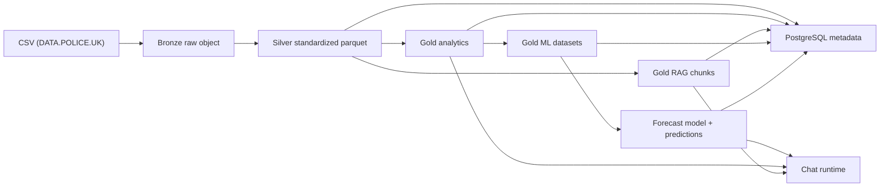

# Medallion Governance Architecture

## Objective

Urban-Lens uses a governed medallion architecture to support three consumption modes:
- evidence-backed factual answers for RAG
- analytical aggregations for rankings and historical comparisons
- supervised forecasts for future incident volume

The medallion pipeline is designed for monthly public crime datasets from `DATA.POLICE.UK`.

## Status

This document is the completion artifact for `T2` in the governance and medallion delivery plan.

`T2` SHALL be considered complete only if:
- path conventions are explicit for Bronze, Silver, and every Gold product family
- the canonical grain is explicit for Silver, Gold analytics, and Gold ML
- quality gates are explicit by layer
- allowed data movement between layers is explicit
- the rationale for Gold segmentation and hybrid chat routing is explicit

## Layer Layout

### Bronze

Purpose:
- Preserve the original CSV exactly as received
- Keep ingestion metadata and integrity information
- Allow replay of downstream jobs

Rules:
- Append-only
- No manual overwrite
- Source path organized by `source`, `year`, `month`, and `force`
- One `dataset_version` per uploaded artifact
- Bronze objects MUST remain immutable after publication

Path pattern:

```text
bronze/data.police.uk/crimes/year=YYYY/month=MM/force=<force_name>/<raw_file>.csv
```

Allowed content:
- the original CSV payload
- raw source metadata captured externally in PostgreSQL

Disallowed content:
- pre-aggregated metrics
- transformed columns
- model features

Replay rule:
- Bronze MUST be sufficient to rebuild every downstream Silver and Gold product for the same source slice

### Silver

Purpose:
- Standardize schema and data types
- Normalize crime categories
- Derive a stable `reference_month`
- Produce occurrence-level parquet for downstream aggregation

Rules:
- Row grain remains one occurrence per record
- Duplicates removed by `record_hash`
- Latitude and longitude converted to numeric
- `crime_type` and `last_outcome_category` normalized to stable keys
- Missing `Month` values inferred from the source path or filename
- Silver MUST keep one row per crime occurrence
- Silver MUST NOT aggregate across area, month, or category
- Silver MUST retain source lineage fields needed for audit and replay

Path pattern:

```text
silver/police_uk/crimes_standardized/year=YYYY/month=MM/part-000.parquet
```

Canonical grain:
- one normalized crime occurrence

Minimum retained columns:
- `reference_month`
- `reported_by`
- `falls_within`
- `longitude`
- `latitude`
- `location`
- `lsoa_code`
- `lsoa_name`
- `crime_type`
- `last_outcome_category`
- `context`
- `has_outcome`
- `has_context`
- `source_file`
- `ingested_at`
- `record_hash`

### Gold

Gold is segmented to avoid coupling between RAG, analytics, and ML workloads.

#### Gold for RAG

Purpose:
- Provide evidence-oriented text records for embedding and retrieval
- Preserve explicit links to geography, period, and crime type
- Carry short, human-readable snippets derived from structured data
- Support retrieval without requiring raw Silver access

Path pattern:

```text
gold/rag/crime_chunks/year=YYYY/month=MM/part-000.parquet
```

Allowed content:
- chunk identifiers
- titles
- short evidence snippets
- source dataset references

Disallowed content:
- training labels
- model predictions
- hidden internal-only metadata not required for retrieval

#### Gold for Analytics

Purpose:
- Answer historical and current questions directly from structured data
- Support both specific and aggregated questions
- Feed factual answers to the chat runtime and operational dashboards

Canonical grains:
- `lsoa_code + reference_month + crime_type`
- `lsoa_code + reference_month`
- `reference_month + crime_type`

Products:
- `crime_metrics_area_month_category`
- `crime_metrics_area_month`
- `crime_metrics_month_category`

Path patterns:

```text
gold/analytics/crime_metrics_area_month_category/year=YYYY/month=MM/part-000.parquet
gold/analytics/crime_metrics_area_month/year=YYYY/month=MM/part-000.parquet
gold/analytics/crime_metrics_month_category/year=YYYY/month=MM/part-000.parquet
```

Allowed content:
- counts
- ratios
- dominant category summaries
- geo and time dimensions

Disallowed content:
- raw records duplicated without aggregation
- model outputs
- retrieval-only text chunks

Consumption mapping:
- `crime_metrics_area_month_category` MUST be the primary source for factual queries scoped by area, month, and crime type.
- `crime_metrics_area_month` MUST be the primary source for executive and comparative views by area and month.
- `crime_metrics_month_category` MUST be the primary source for citywide or dataset-wide rankings by crime type and month.
- API and chat flows SHOULD read Gold Analytics first for historical and present-tense questions before consulting any predictive artifact.

#### Gold for ML

Purpose:
- Train and score a baseline regression model
- Preserve a stable feature contract for future models
- Keep training and scoring datasets separated by intent

Products:
- `forecast_training_set`
- `forecast_scoring_set`
- `forecast_predictions`

Canonical grain:
- `lsoa_code + reference_month + crime_type`

Path patterns:

```text
gold/ml/forecast_training_set/year=YYYY/month=MM/part-000.parquet
gold/ml/forecast_scoring_set/year=YYYY/month=MM/part-000.parquet
gold/ml/forecast_predictions/prediction_month=YYYY-MM/part-000.parquet
```

Allowed content:
- engineered features
- target values for training
- scored predictions for the future period

Disallowed content:
- unversioned ad hoc features
- mixed training and scoring rows in the same artifact
- RAG chunks

Consumption mapping:
- `forecast_training_set` MUST be used only for supervised training and evaluation.
- `forecast_scoring_set` MUST be used only for generating predictions for the next available period.
- `forecast_predictions` MUST be the consumer-facing predictive output exposed to downstream application layers.
- Application layers SHALL NOT use raw training rows as if they were observed facts.

## Source Column Mapping

The CSV structure used by Urban-Lens MUST be normalized as follows:

| Source column | Silver column | Notes |
| --- | --- | --- |
| `Reported by` | `reported_by` | Force that supplied the record |
| `Falls within` | `falls_within` | Force context as received from the source |
| `Longitude` | `longitude` | Numeric, nullable |
| `Latitude` | `latitude` | Numeric, nullable |
| `LSOA code` | `lsoa_code` | Territorial key |
| `LSOA name` | `lsoa_name` | Human-readable territorial label |
| `Crime type` | `crime_type` | Normalized stable key |
| `Last outcome category` | `last_outcome_category` | Normalized stable key |
| `Context` | `context` | Optional human-readable description |

If the source file includes a `Month` field, the pipeline MUST use it as the primary source for `reference_month`.
If the file does not include a month field, the pipeline MUST infer `reference_month` from the source path or file name and record that inference in metadata.

## Data Flow



## Allowed Data Movement

The following movements MUST be allowed:
- Bronze -> Silver
- Silver -> Gold Analytics
- Silver -> Gold RAG
- Silver -> Gold ML
- Gold ML training set -> forecast model training
- Gold ML scoring set -> forecast model scoring

The following movements MUST NOT happen:
- Silver -> Bronze
- Gold -> Silver
- Gold Analytics -> Gold RAG as an input dependency
- Gold ML predictions -> training feature store without explicit reprocessing
- direct consumer access to Bronze for ordinary analytical or chat use

Rebuild rule:
- any Gold or Silver artifact MAY be regenerated from Bronze when a new governed pipeline run is executed

## Canonical Grain

Canonical grains by layer:
- Bronze: raw file
- Silver: occurrence
- Gold Analytics and Gold ML: `lsoa_code + reference_month + crime_type`
- Gold aggregated executive view: `lsoa_code + reference_month`
- Gold citywide ranking view: `reference_month + crime_type`

This choice allows the system to answer:
- area-specific questions
- category-specific questions
- broader ranking questions
- future-volume predictions for a specific area and crime type

## Quality Gates

### Bronze
- File is readable
- Hash is generated
- Source metadata is registered
- Bronze path and source identity are consistent with the monthly partition

### Silver
- Required columns exist
- `reference_month` exists for every row
- Duplicate rows are removed through `record_hash`
- `crime_type` is normalized
- Numeric coordinates are valid when provided
- Silver row count is reconciled against Bronze
- Silver retains enough lineage to rebuild Gold products

### Gold
- Aggregated counts reconcile with Silver
- All Gold datasets have lineage back to Silver
- Gold ML datasets use the official target and feature contract
- Gold analytics and Gold RAG are derived from Silver only
- Gold ML training and scoring are derived from Gold analytics only

## Chat Runtime Policy

The chat runtime follows a hybrid policy.

### Factual questions

Questions about current or historical facts must query Gold datasets only.

Examples:
- “Which area has the highest burglary count?”
- “What is the most frequent crime type this month?”

Required Gold mapping:
- area-specific factual questions MUST query `gold/analytics/crime_metrics_area_month_category`
- area-overview factual questions MUST query `gold/analytics/crime_metrics_area_month`
- category-ranking factual questions MUST query `gold/analytics/crime_metrics_month_category`
- evidence-oriented answer rendering MAY enrich the response with `gold/rag/crime_chunks`

### Predictive questions

Questions about future periods must:
- retrieve historical context from Gold Analytics
- retrieve evidence text from Gold RAG when needed
- call the forecast model for the requested future period

Examples:
- “What is the expected burglary volume next month in this area?”

Required Gold mapping:
- historical context MUST come from `gold/analytics/crime_metrics_area_month_category` or `gold/analytics/crime_metrics_area_month`
- retrieval-oriented explanation MAY use `gold/rag/crime_chunks`
- model input MUST come from `gold/ml/forecast_scoring_set`
- consumer-visible predictive output SHOULD come from `gold/ml/forecast_predictions` when predictions have already been published

### Mixed questions

Questions combining history and future must return:
- one section for observed facts
- one section for model predictions

Predictions must always carry:
- model name
- model version
- training window
- holdout metrics
- uncertainty warning

Required Gold mapping:
- the observed-facts section MUST use Gold Analytics
- the prediction section MUST use Gold ML artifacts
- the response generator SHALL keep those sections logically separated even when rendered in one final answer

## Gold Consumer Reference

This section defines the stable consumer mapping for each Gold artifact family.

| Gold artifact | Primary consumer | Allowed usage | Not allowed usage |
| --- | --- | --- | --- |
| `gold/analytics/crime_metrics_area_month_category` | Chat factual flow, API factual endpoints, analytics consumers | Specific factual answers by area, month, and crime type; feature source for ML | Direct predictive output |
| `gold/analytics/crime_metrics_area_month` | Chat factual flow, API executive endpoints, dashboard summaries | Area overview, comparison, dominant crime type, monthly area panorama | Fine-grained evidence chunks |
| `gold/analytics/crime_metrics_month_category` | Ranking and summary consumers | Category ranking, top crime types, dataset-wide monthly comparison | Area-level detail responses |
| `gold/rag/crime_chunks` | Embedding pipeline, retrieval layer, answer enrichment | Evidence text retrieval, grounding, citation-oriented answer construction | Source of truth for numeric aggregation |
| `gold/ml/forecast_training_set` | ML training and evaluation pipeline | Model training, temporal validation, experiment tracking | Runtime factual answering |
| `gold/ml/forecast_scoring_set` | ML inference pipeline | Feature input for future-period scoring | Direct user-facing prediction without model execution |
| `gold/ml/forecast_predictions` | Predictive API and chat response layer | Published forecast retrieval, predictive explanation payloads | Historical factual answering |

Segregation rules:
- Future maintainers MUST preserve the distinction between factual, retrieval, and predictive Gold products.
- A consumer MAY combine Gold Analytics and Gold RAG in one response, but it SHALL NOT treat Gold RAG as the numeric source of truth.
- A consumer MAY combine Gold Analytics and Gold ML in one response, but it MUST separate observed facts from forecasts.
- New Gold products SHOULD be added to this table before they are exposed to application consumers.
- source dataset version identifiers for the context used

## Implementation Rationale

- Bronze is immutable because it is the evidence source for every downstream artifact.
- Silver remains row-level to preserve traceability and allow flexible downstream aggregation.
- Gold is split because RAG, analytics, and ML have different schema stability and consumption needs.
- Hybrid chat routing is required so factual questions do not depend on model extrapolation and predictive questions do not present forecasts as observed facts.
