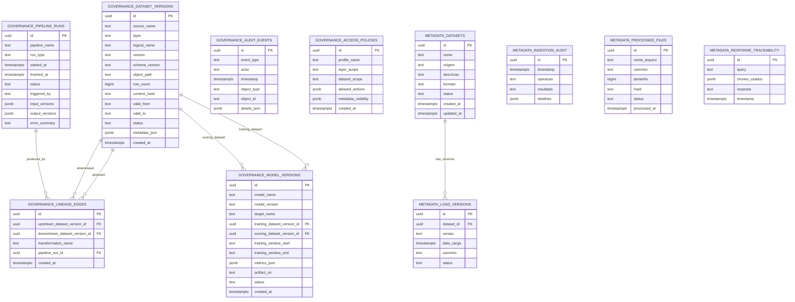

# Modelo Relacional de Metadados

## Objetivo

Este documento descreve o modelo relacional de metadados do Urban-Lens, incluindo diagrama ER, tabelas, campos, relacionamentos e constraints.

O modelo esta dividido em dois schemas PostgreSQL:

- `governance`: metadados canonicos de governanca, lineage, auditoria, politicas de acesso e versoes de modelos.
- `metadata`: catalogo operacional de datasets, versoes de carga, arquivos processados e rastreabilidade de respostas.

## Diagrama ER

## Schema `governance`

### `governance.dataset_versions`

Representa uma versao concreta de dataset publicada nas camadas Bronze, Silver ou Gold. E a principal entidade de rastreabilidade para evidencias, lineage e modelos.

| Campo | Tipo | Obrigatorio | Descricao |
| --- | --- | --- | --- |
| `id` | `UUID` | Sim | Identificador primario da versao do dataset. |
| `source_name` | `TEXT` | Sim | Fonte original ou sistema de origem. |
| `layer` | `TEXT` | Sim | Camada medallion: `bronze`, `silver` ou `gold`. |
| `logical_name` | `TEXT` | Sim | Nome logico estavel do dataset. |
| `version` | `TEXT` | Sim | Versao mensal no formato `YYYY-MM`. |
| `schema_version` | `TEXT` | Sim | Versao do schema do artefato. |
| `object_path` | `TEXT` | Sim | Caminho do objeto no MinIO. |
| `row_count` | `BIGINT` | Sim | Quantidade de linhas do artefato. |
| `content_hash` | `TEXT` | Sim | Hash usado para integridade e reproducibilidade. |
| `valid_from` | `TEXT` | Sim | Inicio da janela temporal no formato `YYYY-MM`. |
| `valid_to` | `TEXT` | Nao | Fim da janela temporal no formato `YYYY-MM`. |
| `status` | `TEXT` | Sim | Estado de publicacao; padrao `available`. |
| `metadata_json` | `JSONB` | Sim | Metadados adicionais de governanca. |
| `created_at` | `TIMESTAMPTZ` | Sim | Data de criacao do registro. |

Constraints principais:

- Primary key em `id`.
- `layer` limitado a `bronze`, `silver`, `gold`.
- `version`, `valid_from` e `valid_to` seguem o formato `YYYY-MM`.
- `row_count >= 0`.
- `valid_to` deve ser nulo ou maior/igual a `valid_from`.
- Unique em `(layer, logical_name, version, object_path)`.

### `governance.pipeline_runs`

Representa uma execucao de pipeline de ingestao, transformacao, publicacao, embedding ou modelo.

| Campo | Tipo | Obrigatorio | Descricao |
| --- | --- | --- | --- |
| `id` | `UUID` | Sim | Identificador primario da execucao. |
| `pipeline_name` | `TEXT` | Sim | Nome do pipeline executado. |
| `run_type` | `TEXT` | Sim | Tipo de execucao: `manual`, `scheduled` ou `ad_hoc`. |
| `started_at` | `TIMESTAMPTZ` | Sim | Inicio da execucao. |
| `finished_at` | `TIMESTAMPTZ` | Nao | Fim da execucao. |
| `status` | `TEXT` | Sim | Estado: `running`, `completed` ou `failed`. |
| `triggered_by` | `TEXT` | Sim | Usuario ou sistema que disparou a execucao. |
| `input_versions` | `JSONB` | Sim | Lista de versoes de entrada. |
| `output_versions` | `JSONB` | Sim | Lista de versoes de saida. |
| `error_summary` | `TEXT` | Nao | Resumo do erro quando a execucao falha. |

Constraints principais:

- Primary key em `id`.
- `run_type` limitado a `manual`, `scheduled`, `ad_hoc`.
- `status` limitado a `running`, `completed`, `failed`.
- `input_versions` e `output_versions` devem ser arrays JSON.

### `governance.lineage_edges`

Representa uma aresta de lineage entre uma versao upstream e uma versao downstream.

| Campo | Tipo | Obrigatorio | Descricao |
| --- | --- | --- | --- |
| `id` | `UUID` | Sim | Identificador primario da aresta. |
| `upstream_dataset_version_id` | `UUID` | Sim | Dataset de entrada. |
| `downstream_dataset_version_id` | `UUID` | Sim | Dataset de saida. |
| `transformation_name` | `TEXT` | Sim | Nome da transformacao aplicada. |
| `pipeline_run_id` | `UUID` | Sim | Execucao responsavel pela transformacao. |
| `created_at` | `TIMESTAMPTZ` | Sim | Data de criacao da aresta. |

Constraints principais:

- Primary key em `id`.
- Foreign keys para `governance.dataset_versions(id)` nos campos upstream e downstream.
- Foreign key para `governance.pipeline_runs(id)`.
- Unique em `(upstream_dataset_version_id, downstream_dataset_version_id, transformation_name)`.

### `governance.audit_events`

Registra eventos operacionais e de governanca para auditoria.

| Campo | Tipo | Obrigatorio | Descricao |
| --- | --- | --- | --- |
| `id` | `UUID` | Sim | Identificador primario do evento. |
| `event_type` | `TEXT` | Sim | Tipo do evento auditado. |
| `actor` | `TEXT` | Sim | Usuario ou sistema responsavel. |
| `timestamp` | `TIMESTAMPTZ` | Sim | Momento do evento. |
| `object_type` | `TEXT` | Sim | Tipo do objeto auditado. |
| `object_id` | `TEXT` | Sim | Identificador do objeto auditado. |
| `details_json` | `JSONB` | Sim | Detalhes adicionais do evento. |

Constraints principais:

- Primary key em `id`.
- `event_type` limitado aos eventos de ingestao, transformacao, publicacao Gold, treino/inferencia de modelo e indexacao de embeddings.
- `object_type` limitado a `dataset_version`, `pipeline_run`, `lineage_edge`, `model_version`.
- `details_json` deve ser objeto JSON.

### `governance.access_policies`

Define politicas de acesso por perfil, camada e dataset.

| Campo | Tipo | Obrigatorio | Descricao |
| --- | --- | --- | --- |
| `id` | `UUID` | Sim | Identificador primario da politica. |
| `profile_name` | `TEXT` | Sim | Perfil de acesso, como `admin`, `analyst`, `manager` ou `operator`. |
| `layer_scope` | `TEXT` | Sim | Camada permitida: `bronze`, `silver`, `gold` ou `*`. |
| `dataset_scope` | `TEXT` | Sim | Dataset especifico ou `*`. |
| `allowed_actions` | `JSONB` | Sim | Lista de acoes permitidas. |
| `metadata_visibility` | `JSONB` | Sim | Regras de visibilidade de metadados. |
| `created_at` | `TIMESTAMPTZ` | Sim | Data de criacao da politica. |

Constraints principais:

- Primary key em `id`.
- `layer_scope` limitado a `bronze`, `silver`, `gold`, `*`.
- `allowed_actions` deve ser array JSON.
- `metadata_visibility` deve ser objeto JSON.
- Unique em `(profile_name, layer_scope, dataset_scope)`.

### `governance.model_versions`

Representa uma versao registrada de modelo supervisionado ou artefato de ML.

| Campo | Tipo | Obrigatorio | Descricao |
| --- | --- | --- | --- |
| `id` | `UUID` | Sim | Identificador primario da versao do modelo. |
| `model_name` | `TEXT` | Sim | Nome logico do modelo. |
| `model_version` | `TEXT` | Sim | Versao do modelo, normalmente ligada ao run/artifact. |
| `target_name` | `TEXT` | Sim | Variavel alvo do modelo. |
| `training_dataset_version_id` | `UUID` | Sim | Dataset usado para treinamento. |
| `scoring_dataset_version_id` | `UUID` | Sim | Dataset usado para scoring. |
| `training_window_start` | `TEXT` | Sim | Inicio da janela de treino em `YYYY-MM`. |
| `training_window_end` | `TEXT` | Sim | Fim da janela de treino em `YYYY-MM`. |
| `metrics_json` | `JSONB` | Sim | Metricas do modelo. |
| `artifact_uri` | `TEXT` | Sim | URI do artefato no MLflow ou storage. |
| `status` | `TEXT` | Sim | Estado da versao; padrao `ready`. |
| `created_at` | `TIMESTAMPTZ` | Sim | Data de registro da versao. |

Constraints principais:

- Primary key em `id`.
- Foreign keys para `governance.dataset_versions(id)` em datasets de treino e scoring.
- `training_window_start` e `training_window_end` seguem `YYYY-MM`.
- `training_window_end >= training_window_start`.
- `metrics_json` deve ser objeto JSON.
- Unique em `(model_name, model_version)`.

## Schema `metadata`

### `metadata.datasets`

Catalogo operacional dos datasets conhecidos pela plataforma.

| Campo | Tipo | Obrigatorio | Descricao |
| --- | --- | --- | --- |
| `id` | `UUID` | Sim | Identificador primario, gerado por `gen_random_uuid()`. |
| `nome` | `TEXT` | Sim | Nome do dataset. |
| `origem` | `TEXT` | Sim | Fonte do dataset. |
| `descricao` | `TEXT` | Nao | Descricao do conteudo. |
| `formato` | `TEXT` | Sim | Formato fisico do dado. |
| `status` | `TEXT` | Sim | Estado do dataset no catalogo. |
| `created_at` | `TIMESTAMPTZ` | Sim | Data de criacao do registro. |
| `updated_at` | `TIMESTAMPTZ` | Sim | Data de ultima atualizacao. |

Constraints principais:

- Primary key em `id`.
- `formato` limitado a `csv`, `json`, `parquet`, `geojson`, `other`.
- `status` limitado a `active`, `deprecated`, `pending`.
- Unique em `(nome, origem)`.
- Trigger `trg_datasets_updated_at` atualiza `updated_at` antes de updates.
- Indices em `status` e `origem`.

### `metadata.load_versions`

Registra versoes de carga associadas a um dataset catalogado.

| Campo | Tipo | Obrigatorio | Descricao |
| --- | --- | --- | --- |
| `id` | `UUID` | Sim | Identificador primario, gerado por `gen_random_uuid()`. |
| `dataset_id` | `UUID` | Sim | Dataset ao qual a carga pertence. |
| `versao` | `TEXT` | Sim | Versao da carga. |
| `data_carga` | `TIMESTAMPTZ` | Sim | Data e hora da carga. |
| `caminho` | `TEXT` | Sim | Caminho do artefato carregado. |
| `status` | `TEXT` | Sim | Estado da carga. |

Constraints principais:

- Primary key em `id`.
- Foreign key `dataset_id` para `metadata.datasets(id)` com `ON DELETE CASCADE`.
- `status` limitado a `pending`, `running`, `success`, `failed`.
- Unique em `(dataset_id, versao)`.
- Indices em `dataset_id` e `status`.

### `metadata.ingestion_audit`

Registra eventos de ingestao e transformacao ligados ao fluxo operacional.

| Campo | Tipo | Obrigatorio | Descricao |
| --- | --- | --- | --- |
| `id` | `UUID` | Sim | Identificador primario, gerado por `gen_random_uuid()`. |
| `timestamp` | `TIMESTAMPTZ` | Sim | Momento do evento. |
| `operacao` | `TEXT` | Sim | Operacao executada. |
| `resultado` | `TEXT` | Sim | Resultado da operacao. |
| `detalhes` | `JSONB` | Sim | Detalhes da execucao. |

Constraints principais:

- Primary key em `id`.
- `operacao` limitada a `ingest_started`, `ingest_finished`, `validation_failed`, `transform_started`, `transform_finished`, `schema_change_detected`.
- `resultado` limitado a `ok`, `warning`, `error`.
- `detalhes` deve ser objeto JSON.
- Indices em `timestamp DESC`, `operacao` e `detalhes` via GIN.

### `metadata.processed_files`

Controla arquivos ja processados ou em processamento.

| Campo | Tipo | Obrigatorio | Descricao |
| --- | --- | --- | --- |
| `id` | `UUID` | Sim | Identificador primario, gerado por `gen_random_uuid()`. |
| `nome_arquivo` | `TEXT` | Sim | Nome do arquivo. |
| `caminho` | `TEXT` | Sim | Caminho unico do arquivo. |
| `tamanho` | `BIGINT` | Sim | Tamanho em bytes. |
| `hash` | `TEXT` | Sim | Hash do arquivo. |
| `status` | `TEXT` | Sim | Estado de processamento. |
| `processed_at` | `TIMESTAMPTZ` | Nao | Data em que o arquivo foi processado. |

Constraints principais:

- Primary key em `id`.
- Unique em `caminho`.
- `tamanho >= 0`.
- `status` limitado a `pending`, `processing`, `processed`, `failed`, `skipped`.
- Indices em `status` e `hash`.

### `metadata.response_traceability`

Armazena rastreabilidade basica de respostas, registrando pergunta, chunks usados e resposta final.

| Campo | Tipo | Obrigatorio | Descricao |
| --- | --- | --- | --- |
| `id` | `UUID` | Sim | Identificador primario, gerado por `gen_random_uuid()`. |
| `query` | `TEXT` | Sim | Pergunta recebida. |
| `chunks_usados` | `JSONB` | Sim | Lista de chunks usados na resposta. |
| `resposta` | `TEXT` | Sim | Resposta retornada. |
| `timestamp` | `TIMESTAMPTZ` | Sim | Momento da resposta. |

Constraints principais:

- Primary key em `id`.
- `chunks_usados` deve ser array JSON.
- Indices em `timestamp DESC` e `chunks_usados` via GIN.

## Relacionamentos

Relacionamentos fisicos com foreign key:

| Origem | Destino | Cardinalidade | Descricao |
| --- | --- | --- | --- |
| `governance.lineage_edges.upstream_dataset_version_id` | `governance.dataset_versions.id` | N:1 | Cada aresta aponta para uma versao de entrada. |
| `governance.lineage_edges.downstream_dataset_version_id` | `governance.dataset_versions.id` | N:1 | Cada aresta aponta para uma versao de saida. |
| `governance.lineage_edges.pipeline_run_id` | `governance.pipeline_runs.id` | N:1 | Cada aresta foi produzida por uma execucao. |
| `governance.model_versions.training_dataset_version_id` | `governance.dataset_versions.id` | N:1 | Cada modelo registra o dataset usado no treinamento. |
| `governance.model_versions.scoring_dataset_version_id` | `governance.dataset_versions.id` | N:1 | Cada modelo registra o dataset usado no scoring. |
| `metadata.load_versions.dataset_id` | `metadata.datasets.id` | N:1 | Cada versao de carga pertence a um dataset catalogado. |

Relacionamentos logicos sem foreign key:

| Tabela | Ligacao logica | Motivo |
| --- | --- | --- |
| `governance.audit_events` | `object_type` + `object_id` apontam para objetos auditados | Permite auditar tipos diferentes sem multiplas FKs opcionais. |
| `metadata.ingestion_audit` | `detalhes` pode conter `dataset_id`, pipeline, arquivo ou contadores | Evento operacional flexivel em JSONB. |
| `metadata.processed_files` | `hash` e `caminho` podem ser reconciliados com cargas e objetos no lake | A tabela controla arquivos, nao versoes canonicas. |
| `metadata.response_traceability` | `chunks_usados` referencia chunks e fontes RAG | Chunks estao no Milvus/Gold RAG, nao em tabela relacional local. |

## Constraints e regras de integridade

- Identificadores primarios usam `UUID` em todas as tabelas.
- O schema `metadata` gera UUID com `gen_random_uuid()` via extensao `pgcrypto`.
- O schema `governance` recebe UUID explicitamente, favorecendo reproducibilidade em pipelines.
- Valores controlados usam `CHECK` para impedir estados ou tipos invalidos.
- Campos JSONB possuem `CHECK` para garantir objeto ou array conforme o contrato.
- Tabelas com objetos versionados usam `UNIQUE` para impedir duplicidade de versao ou escopo.
- `metadata.load_versions` usa `ON DELETE CASCADE`, removendo cargas quando o dataset catalogado e removido.
- `metadata.datasets.updated_at` e atualizado automaticamente por trigger antes de updates.
- Indices foram criados para consultas frequentes por status, origem, timestamp, operacao, hash e conteudo JSONB.

## Observacoes de uso no RAG

- Evidencias do RAG devem apontar para versoes de dataset, fonte, referencia temporal e metadados de origem.
- Metadados tecnicos sensiveis, como runs, prompts, metricas internas e traces de execucao, devem respeitar politicas de acesso antes de aparecer no chat.
- `governance.dataset_versions` e a referencia canonica para lineage e citacao de dados publicados.
- `metadata.response_traceability` registra a resposta entregue, mas nao substitui a evidencia retornada pela API RAG.
