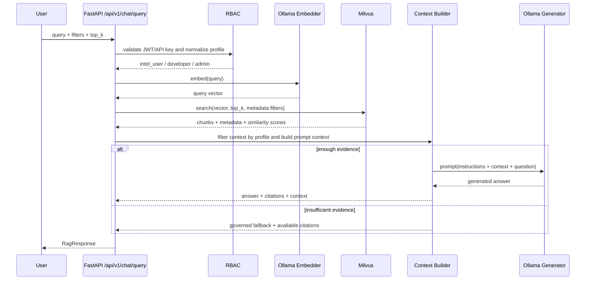

# Urban Lens RAG End-to-End Flow

## Purpose

This document defines the Sprint 6 RAG contract and the end-to-end flow used by the API chat pipeline. The goal is to keep retrieval, prompt assembly, answer generation, and evidence return traceable and role-governed.

## Canonical Contract

The canonical interface lives in `src/urban_lens/rag/contracts.py`.

| Object | Responsibility |
|---|---|
| `RagQuery` | User question, top-k, metadata filters, normalized profile, Ollama model, and context budget |
| `RagFilters` | Region/LSOA, reference month/period, crime type, and controlled chunk type filter |
| `RagContextChunk` | Retrieved text plus score, source, timestamp, reference, and role-filtered metadata |
| `EvidenceCitation` | User-facing citation with stable id (`E1`), source, score, timestamp, excerpt, and reference |
| `RagAnswer` | Generated text plus answer status (`answered` or `insufficient_evidence`) |
| `RagResponse` | Final API contract: answer, evidences, context, profile, and fallback reason |

Minimum evidence fields are always present: `score`, `source`, `timestamp`, and `reference`.

## Sequence

## Retrieval Design

The pipeline creates an embedding for the user query through Ollama and selects the retrieval corpus by intent:

- `crime_chunks` for crime evidence questions
- `knowledge_chunks` for platform, model, metric, and preprocessing questions
- hybrid retrieval when the question is generic

Supported crime-side filters are mapped to Milvus fields:

| User filter | Milvus field |
|---|---|
| `region` / `lsoa_code` | `lsoa_code` |
| `period` / `reference_month` | `reference_month` |
| `crime_type` | `crime_type` |
| `chunk_type` | `chunk_type`, only for `developer` and `admin` |

Default `top_k` is 5. The API allows 1 to 20 chunks. The context builder formats evidence blocks as `[E1]`, `[E2]`, etc. and respects a character budget before prompt generation.

## Prompt Design

The initial prompt template contains:

1. System instruction: answer only from supplied evidence and cite evidence ids.
2. Access rule: profile-specific restriction for `intel_user`, `developer`, or `admin`.
3. Evidence context: source, reference, score, timestamp, and content.
4. User question.

The prompt detects the question language with a lightweight local rule. Portuguese questions receive Portuguese prompt instructions and English/default questions receive English prompt instructions. In both cases, the model is asked to answer directly, avoid repeating the question, preserve identifiers/place names/model names/dataset references/crime categories exactly as they appear in the evidence, and cite evidence ids such as `[E1]`.

After generation, the pipeline also removes a leading line when it only repeats the user's question. This keeps the API response focused while preserving the model's evidence-based answer.

## Evidence and Citations

Each returned evidence includes:

| Field | Meaning |
|---|---|
| `id` | Citation id used by the answer (`E1`) |
| `source` | Human-readable title or source |
| `reference` | Stable dataset/run/document reference |
| `score` | Similarity score from retrieval |
| `timestamp` | Context assembly timestamp |
| `excerpt` | Short evidence text shown to the user |
| `metadata` | Metadata allowed for the caller profile |

## Access Rules

`viewer` and `operator` are treated as `intel_user` for the chat pipeline. `internal_service` is treated as `admin`.

| Profile | Allowed context | Restricted fields |
|---|---|---|
| `intel_user` | Operational crime evidence plus authorized platform knowledge | raw prompts, artifact URIs, secret-bearing params, and restricted experiment metadata |
| `developer` | Operational evidence plus authorized technical/experiment metadata | raw prompts and artifact URIs |
| `admin` | Operational, governance, and technical context available in retrieved evidence | hidden system prompt |

The pipeline filters context before prompt assembly, so unauthorized chunks are never sent to Ollama.

## Fallback

If retrieval returns no authorized evidence, embeddings are empty, the best score is below `min_score`, or generation returns an empty answer, the API returns:

- `answer.status = "insufficient_evidence"`
- a governed message telling the user to refine filters or index more Gold data
- any authorized evidence that was available
- `fallback_reason` for observability

This prevents hallucinated answers when the evidence base is weak.

## API Surface

- `POST /api/v1/query`: semantic search only, returns ranked chunks.
- `POST /api/v1/chat/query`: full RAG flow, returns answer, evidences, context, normalized profile, and fallback reason.

`/api/v1/query` preserves the earlier API role policy and accepts `viewer`, `operator`, `admin`, and `internal_service`. `/api/v1/chat/query` is the Sprint 6 governed chat endpoint and accepts `viewer`, `operator`, `intel_user`, `developer`, `admin`, and `internal_service`; roles are normalized before prompt assembly.

Both paths remain fully local: embeddings and generation use Ollama, retrieval uses Milvus, and governance/audit metadata remains in PostgreSQL-backed project infrastructure.

## Local Validation Notes

The end-to-end flow can be validated with controlled Milvus chunks in a local environment before the full Gold RAG indexing pipeline is populated. Any local chunk names such as `Sprint 6 Westminster burglary evidence` or references like `sprint6-test-dataset:2024-01` are temporary validation data inserted manually into Milvus; they are not part of the application contract, repository fixtures, or production dataset.

Expected Postman checks for `POST /api/v1/chat/query`:

- `answer.status` is `answered` when authorized evidence is retrieved.
- `evidences` contains citation ids such as `E1`.
- each evidence includes `source`, `reference`, `score`, `timestamp`, `excerpt`, and role-filtered `metadata`.
- `fallback_reason` is `null` for answered queries.
- for missing or unauthorized evidence, `answer.status` is `insufficient_evidence` and `fallback_reason` explains why.
